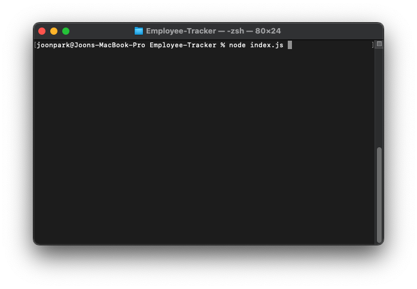
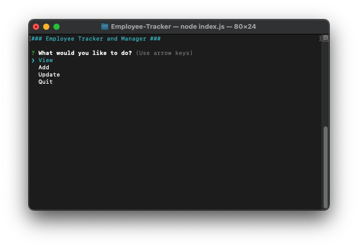
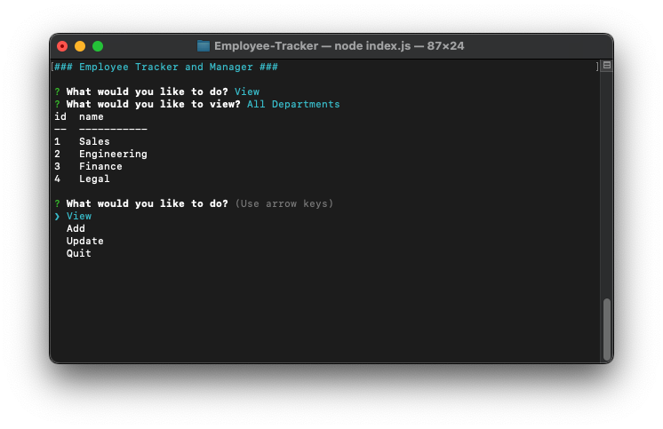
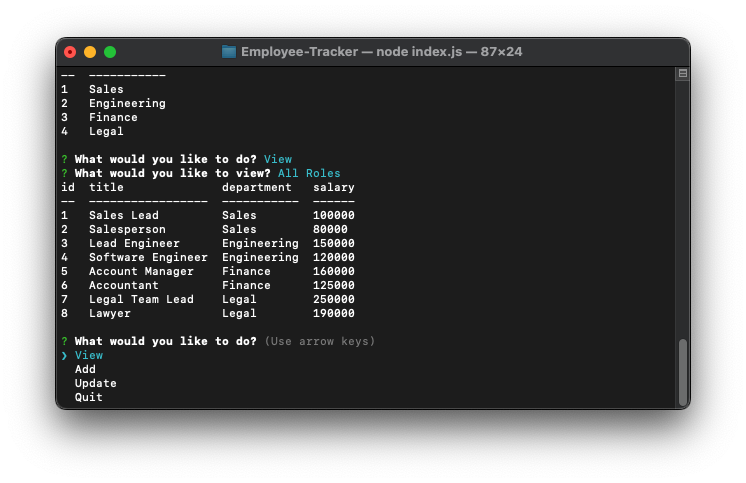
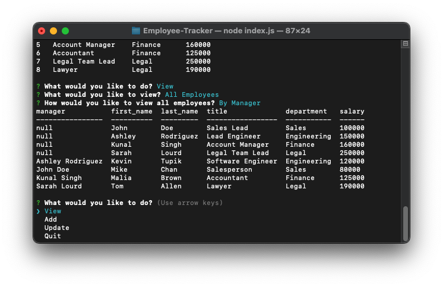
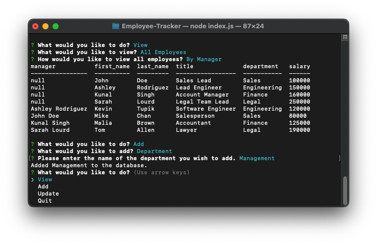
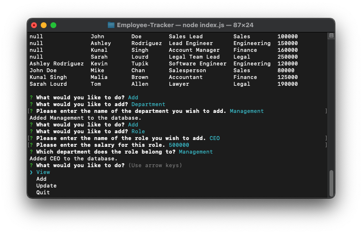
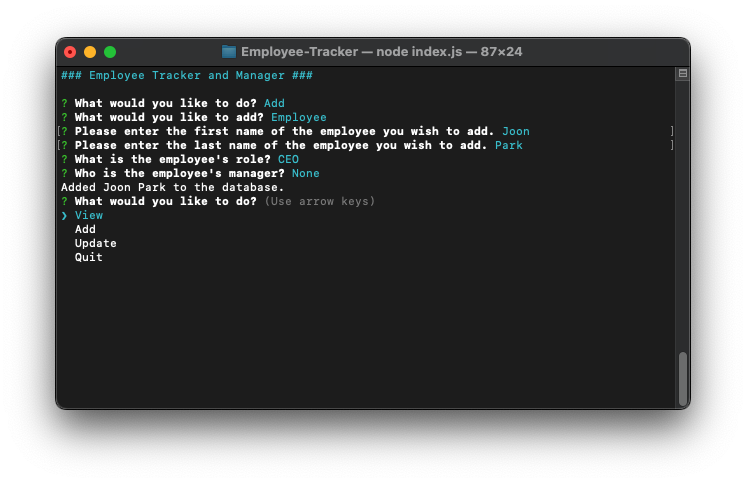
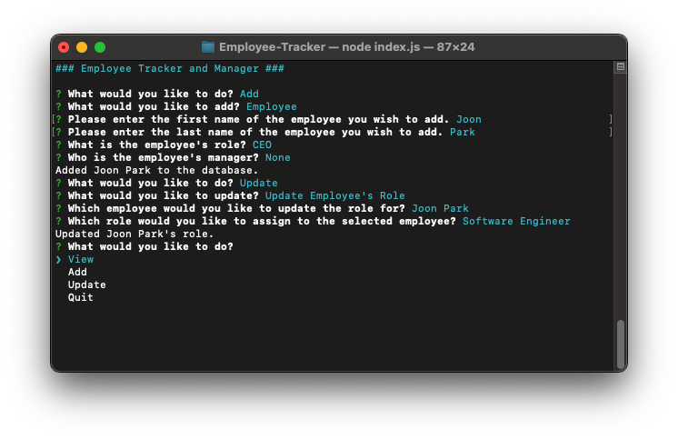
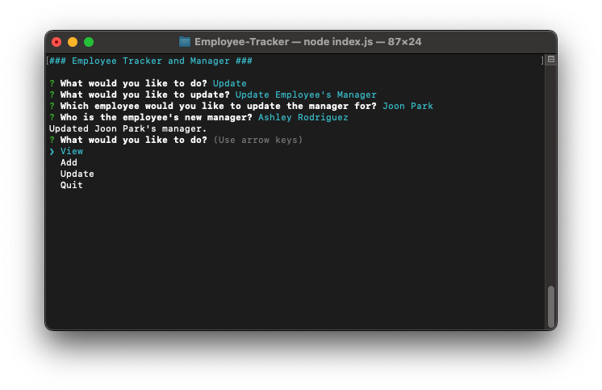

# Employee-Tracker

## Description

[](https://opensource.org/licenses/MIT)

A command-line application that allows the user to access a mySQL database to view and manage a company's departments, roles, and employees.

## Usage

Clone this repo into a local folder. Enter the following node command into Terminal/command prompt to install the necessary dependencies:

```shell
npm install
```

Then, enter the following command to run the application:

```shell
node index.js
```





To view all departments, roles, or employees, select "View" and follow the prompts:







To add a department, role, or employee, select "Add" and follow the prompts:







You may also update an existing employee's role or manager by selecting "Update":






## Walkthrough Video

[Walkthrough Video](https://www.youtube.com/watch?v=)

## License

Licensed under the MIT license.